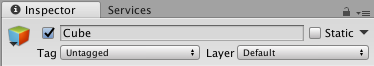

Layer 用来设定某些 GameObject 的功能，比如，哪些 Layer 的 GameObject 应当被绘制，哪些应该被 RayCast 忽略掉。

在这里设置 Layer ：

有一些 Layer 是默认设置好的，还可以自己设置 Layer 。

在 Camera 的 Camera Component 里，有一个 Culling Mask 属性，它设定了可以被摄像头看到的 Layer 。
